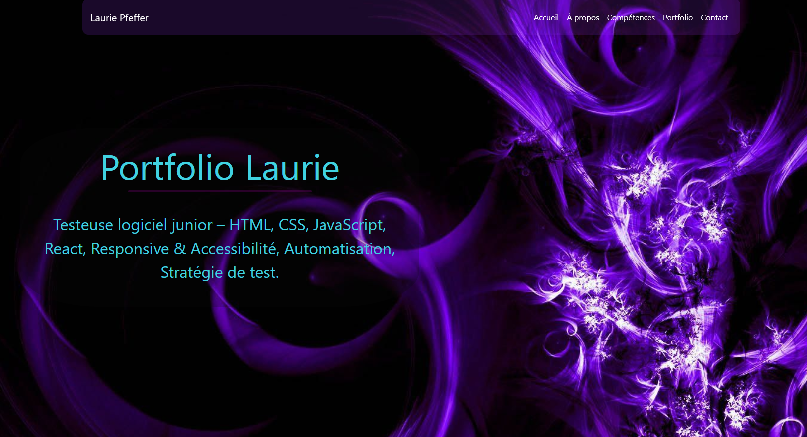

# Portfolio - [Laurie] [Pfeffer]

Portfolio personnel testeuse logiciel junior, créé avec HTML, CSS et JavaScript.

[Portfolio en ligne](https://kaorilan.github.io/Portfolio/)]

## Aperçu

Site vitrine présentant mon parcours, mes compétences et mes projets réalisés.  
Design moderne, responsive, avec chargement dynamique des sections "Compétences" et "Portfolio" depuis des fichiers JSON.

  

## Fonctionnalités

- Navigation fixe avec effet sombre au scroll  
- Hero section avec image de fond  
- Section "À propos" avec photo circulaire et bio  
- Section "Compétences" générée dynamiquement depuis `skills.json`  
- Section "Portfolio" générée dynamiquement depuis `portfolio.json`  
- Section "Contact" avec icônes Font Awesome  
- Menu mobile qui se ferme après clic sur un lien  
- Responsive sur mobile, tablette et desktop (Bootstrap 5)

## Technologies utilisées

- HTML5  
- CSS3 + Bootstrap 5.1.3  
- JavaScript (vanilla)  
- Font Awesome 6 (icônes)  
- JSON pour les données dynamiques  
- GitHub Pages (hébergement)

## Structure du projet

portfolio/
├── index.html              # Page principale
├── style.css               # Styles personnalisés
├── script/
│   └── script.js           # Logique JS (navbar, JSON loading, etc.)
├── data/
│   ├── skills.json         # Données compétences
│   └── portfolio.json      # Données projets
├── images/                 # Images (person.png, compétences, projets, etc.)
└── README.md

